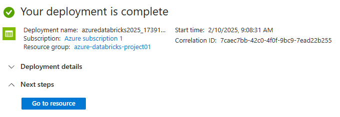
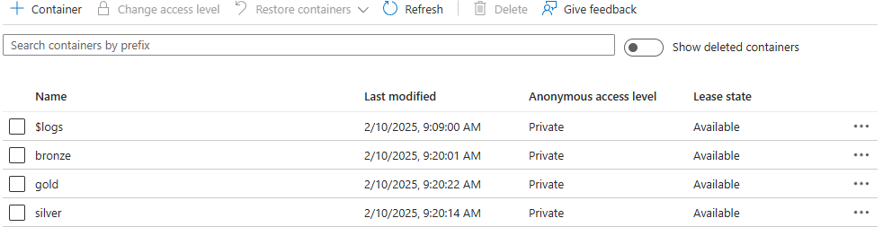
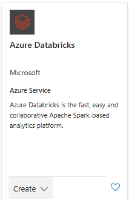

# Azure + Databricks

# Settings the services: 

> Create a resource > Storage > Storage accounts 

> Review + Create

> Go to resource

Create the medallion arquicteture

Data storgae > Containers > + Container

 > 

Create bronze, silver and gold container:

# Activating  Databricks

Microsoft Azure > Inside "resource group" > Create > Search: Azure Databricks > Create

 >  > 

Review + create > create > Go to resource > Launch Workspace

Finally, we have Databricks!!! 

# Working with Notebook - Databricks

Workspace > Workspace > Users > Create > Notebook

## Upload the file...

Return to Microsoft Azure home > storage account > Container > bronze > Upload

Upload the file SRAG_01-06.csv

## Mount the path to file

Storage account > Security + networking > Access Key > Show > Copy

## Follow the notebook...

## checking the files created:

And inside _delta_log folder:

## checking gold:

