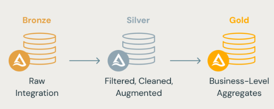

# Databricks_Azure_001

## Objectives:
* Simple integration with Azure and Databricks. 

* Applying Medallion Architecture inside Databricks using Spark-SQL and Pyspark:

 Image from https://www.databricks.com/glossary/medallion-architecture

Please follow a step by step [here](Projeto_Azure_Databricks.md)

### Thanks to [Fabricio Mattos](linkedin.com/in/fabricio-mattos-7238588)
